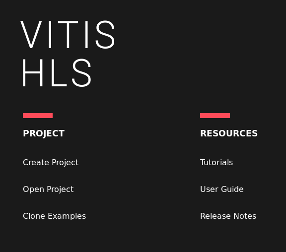
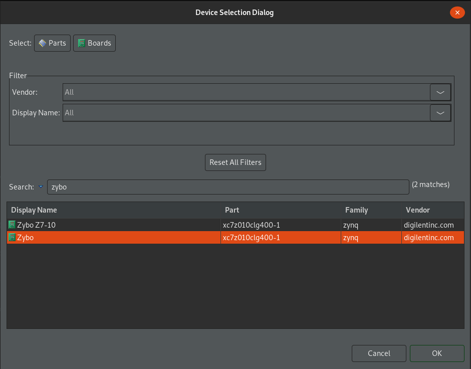
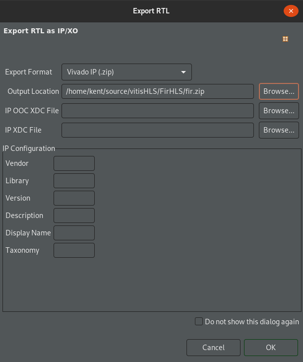
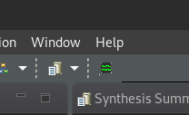
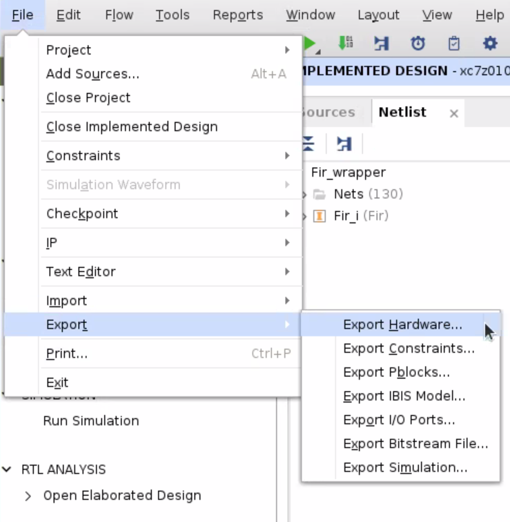

# Using HLS with Zybo Zynq-7000 development board

## Table of Contents

* [Introduction](#introduction)
* [Prerequisites](#prerequisites)
1. [High Level Synthesis in Vitis HLS](#1-high-level-synthesis-in-vitis-hls)
	1. [Create New Project](#11-create-new-project)
	1. [Create Source Files](#12-create-source-files)
	1. [Get Source Code from Github](#13-get-source-code-from-github)
	1. [Simulation and Synthesis](#14-simulation-and-synthesis)
	1. [Export RTL as IP](#15-export-rtl-as-ip)
1. [Hardware Setup in Vivado](#2-hardware-setup-in-vivado)
	1. [Create New Project](#21-create-new-project)
	1. [Create Block Design](#22-create-block-design)
	1. [Create HDL Wrapper and Generate Bitstream](#23-create-hdl-wrapper-and-generate-bitstream)
	1. [Export Hardware Platform](#24-export-hardware-platform)
1. [Application Setup in Vitis](#3-application-setup-in-vitis)
	1. [Create Platform Project](#31-create-platform-project)
	1. [Create Application Project](#32-create-application-project)
	1. [Get Source Code from Github](#33-get-source-code-from-github)
	1. [Build and Run Project](#34-build-and-run-project)
1. [Further Reading](#further-reading)

## Introduction
This is a complete guide for utilising a Vitis HLS design with the Zybo Zynq-7000 development board. We will use a simple FIR (Finite Impulse Response) moving average filter as an example.

The guide has been made for the USN course CS4110 by Kent Odde and Stian Onarheim upon request of Professor Jose Ferreira.

## Prerequisites
* Vitis 2021.X
* Viviado 2021.X
* Vitis HLS 2021.X
* Zybo Zynq-7000 development board


## 1. High Level Synthesis in Vitis HLS

### 1.1 Create New Project
Open up Vitis HLS and choose `Create Project`.



Give the project a suitable name and location.


For now, skip adding design and testbench files. We will do this at a later
stage. Click `Next`.


Click the "Three horizontal dots" button under `Part Selection`.


In the `Device Selection Dialog`, press `Boards` and search for `Zybo`.
To install board files, look at Jose and Manuels guide [here](https://usn.instructure.com/courses/24824/pages/w2-day-1-zybo-hw-development-tutorial?module_item_id=269761).

If the board does not show up, try clicking `Boards` again after searching and the board should appear. 

If on Linux, also follow the instructions in the last post [here](https://forum.digilentinc.com/topic/16795-vivado-hls-board-files-for-the-zyboz7-20/).



Give the solution a suitable name and press `Finish`.


### 1.2 Create Source Files
On the left side in the Explorer window, right-click `Sources` and click `New
file`. Add the files `fir.c` and `fir.h`.

Right-click on `Test Bench`, click `New file` and add the file `tb.c`.


The file tree should now look like this:


### 1.3 Get Source Code from Github
The source code can be found here:
* [tb.c](src/hls/tb.c)
* [fir.c](src/hls/fir.c)
* [fir.h](src/hls/fir.h)

The files should now look like this:

`fir.h`


`fir.c`


`tb.c`


Go to `Project` --> `Project Settings` --> `Syntesis`. Select `fir.c` and click `Browse` to select the top level function for synthesis. In our case this is `fir`.


### 1.4 Simulation and Synthesis
In the Flow navigator window as seen below:


Run the C simulation and ensure that the output looks something like this:
```
utput:  Abbbbbbbbbbbbbbbbbb
INFO: [SIM 211-1] CSim done with 0 errors.
INFO: [SIM 211-3] *************** CSIM finish ***************
INFO: [HLS 200-111] Finished Command csim_design CPU user time: 23.45 seconds. CPU system time: 1.31 seconds. Elapsed time: 24.48 seconds; current allocated memory: 251.756 MB.
Finished C simulation.
```

Run the C Synthesis and ensure that the output looks something like this:


The code is not optimised and has timing violations. Since this is only an example, this is fine.

#### [Optional] Improve the latency

Swap out the content of `fir.c` with [fir_improved.c](src/hls/fir_improved.c) and run C Synthesis again.


### 1.5 Export RTL as IP

In the Flow navigator window, press the `Export RTL` button and save the ZIP file in a suitable location. When prompted by the `Run Cosimulation` window, keep it set to `Verilog`, and set dump trace to `all` in order to later see the waveform. (See image below).




#### [Optional] View the waveform

Run Cosimulation and press the `Waveform` button in the top menu and wait for the Vivado program to open.



It should look something like this:


## 2. Hardware Setup in Vivado

### 2.1 Create New Project
As we assume some familiarity with the Vivado Design Suite, we will not go over how to create a new project.
Create a new Vivado project and do not create any files.

Remember to select the correct board file. You can find it by searching for `Zybo`. (You might have to click the 'Refresh' button).
Ensure that the `Board Rev` is `B.4`.


### 2.2 Create Block Design

In the `Flow Navigator` window, under `IP INTEGRATOR` click `Create Block Design`.


In the `Diagram` window, press the `+` button or right-click and press `Add IP`.

Search for `Zynq` in the pop-up window and double-click `ZYNQ7 Processing System`.


Locate the ZIP file that we exported in step [1.5](#15-export-rtl-as-ipxo), and unzip the file.


Go back to the `Flow Navigator` window in Vivado and click `IP Catalog` under `PROJECT MANAGER`.

Right-click anywhere in the `IP Catalog` tab and click `Add Repository` and select the folder that we unzipped.


Expand the `User Repository` folder and double-click `Fir`.


Click the `Add IP to Block Design` button.


Return to the `Diagram` window. It should now look something like this:


Click `Run Block Automation`.
The presets should look like the image below. Click the `OK` button.


Click `Run Connection Automation`.
The presets should look like the image below. Click the `OK` button.


Click the `Regenerate Layout` button located in the `Diagram` window's toolbar.


If everything is done correctly, the diagram should now look like this:


Click the `Validate Design` button located in the `Diagram` window's toolbar.


Ignore the four critical warning messages.
Click the `OK` button.


### 2.3 Create HDL Wrapper and Generate Bitstream

Right-click the design file under `Sources` and click `Create HDL Wrapper`.


Select the `Let Vivado manage wrapper and auto-update` option and click the `OK` button.


In the `Flow Navigator` window, click the `Generate Bitstream` button located under `PROGRAM AND DEBUG`.


Click the `OK` button.


This will take some time. Eventually you will be met with a window like this:


### 2.4 Export Hardware Platform

Click `File` --> `Export` --> `Export Hardware`.



Choose the `Include bitstream` option and click the `Next` button.


Choose a suitable XSA file name and location. In the final window, click the `Finish` button.


## 3. Application Setup in Vitis

### 3.1 Create Platform component

Continue in your vitis workspace, and click + button:


Choose a suitable platform project name and click `Next`.


Select Hardware Design, and specify the XSA file that we created in step [2.4](#24-export-hardware-platform).


Ensure that the `Software Specification` section matches the image below, and click `Finish`.


Click finish.


Wait for Vitis to complete loading:


Click build:


### 3.2 Create Application Project

Click file>New Component>From Examples


Select Hello World


Click the button "Create Application component from template" without changing any of the options.


Specify a name and click next.


Select the Fir_platform from earlier


Should look like this:


### 3.3 Get Source Code from Github
The source code can be found here:
* [main.c](src/main.c)

Swap the file content of `helloworld.c` with `src/main.c` from the Git repository.

### 3.4 Build and Run Project

Build the component


Remember to set the boot mode jumper (21 in the Figure) to JTAG mode (to the far right).


Run the component while the Zybo board is connected.


Use a serial communication tool (screen, PuTTY) to interact with your application running on the Zybo.

We will use putty:


At all times it should print out the moving average of the three last entered characters.

For instance, entering the sequence `a b c` repeatedly, should result in only `b`'s as output, as this will
be the current moving average.


# Further Reading

See section 4 in the [Vitis High-Level Synthesis User Guide](https://www.xilinx.com/support/documentation/sw_manuals/xilinx2020_2/ug1399-vitis-hls.pdf) for more information about the AXI4-Lite slave C drivers.
