# Using HLS with Zybo Zynq-7000 development board

## Table of Contents

* [About the Project](#about-the-project)
* [Example Programs](#example-programs)
* [Source Code](#source-code)
* [Computer](#computer)
	* [CPU](#cpu)
* [Assembler](#assembler)
* [Usage](#usage)
* [In Action](#in-action)
* [License](#license)
* [Contact](#contact)

## Introduction
This is a complete guide to utilising a Vitis HLS design with the Zybo Zynq-7000 development board. We will use a simple `FIR` (Finite Impulse Response) as an example.

## Prerequisits
* Vitis 2021.X
* Viviado 2021.X
* Vitis HLS 2021.X
* Zybo Zynq-7000 development board

## 1. Vitis HLS

### 1.1 Create new project
Open up Vitis HLS and choose `Create Project`.


Give the project a suitable name and location, and click `Next`.

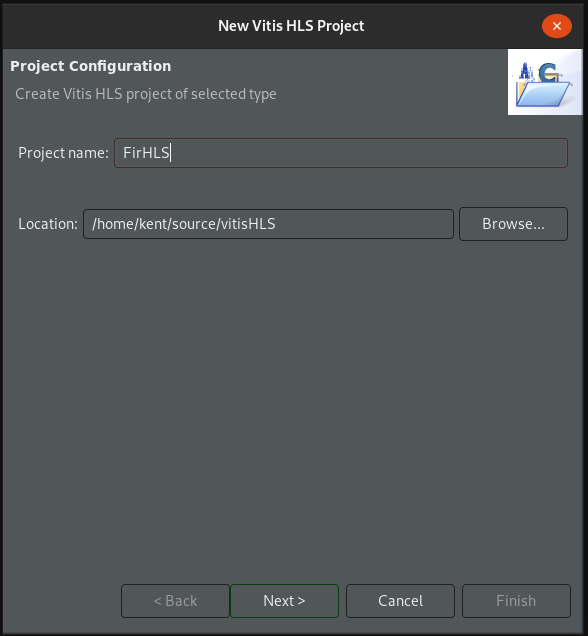

For now, skip adding design and testbench files. We will do this at a later
stage. Click `Next`.


Clik the "Three dots button" under `Part Selection`.


In the Device Selection Dialog pess `Boards` and search for `Zybo`.


Give the solution a suitable name and press `Finish`.

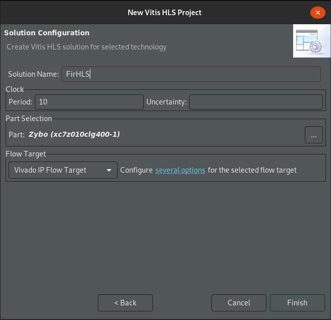

### 1.2 Create source files
On the left side in the Explorer window, right-click `Sources` and clik `New
file`. Add the files `fir.c` and `fir.h`.

Right-click on `Test Bench`, click `New file` and add the file `tb.c`.

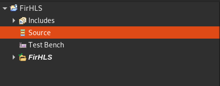

The file tree should now look like this:


### 1.3 Copy paste file content from Git.
The source code can be found here:
* [tb.c](src/hls/tb.c)
* [fir.c](src/hls/fir.c)
* [fir.h](src/hls/fir.h)

The files should now look like this:

`fir.h`

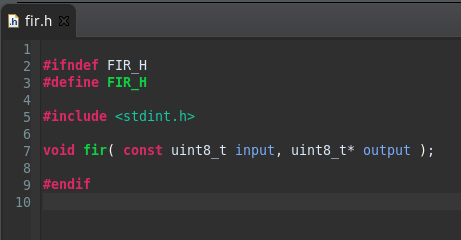

`fir.c`


`tb.c`


### 1.4 Simulation and synthesis
In the Flow navigator window as seen below:


Run the C simulation and ensure that the output looks something like this:
```
utput:  Abbbbbbbbbbbbbbbbbb
INFO: [SIM 211-1] CSim done with 0 errors.
INFO: [SIM 211-3] *************** CSIM finish ***************
INFO: [HLS 200-111] Finished Command csim_design CPU user time: 23.45 seconds. CPU system time: 1.31 seconds. Elapsed time: 24.48 seconds; current allocated memory: 251.756 MB.
Finished C simulation.
```

Run the C Synthesis and ensure that the output looks something like this:


The code is not optimised and has timing violations. Since this is only an example, this is fine.

### 1.5 Export RTL as IP/XO

In the Flow navigator window, press the `Export RTL` button and save the ZIP file in a suitable location.


#### [Optional] View the waveform

Run Cosimulation and press the `Waveform` button in the top menu and wait for the Vivado program to open.


It should look something like this:


## 2. Vivado

### 2.1 Create new project
As we assume some familiarity with the Vivado Design Suite, we will not go over how to create a new project.
Create a new Vivado project and do not create any files.

Remember to select the correct board file. You can find it by searching for `Zybo`. (You might have to click the 'Refresh' button).
Ensure that the `Board Rev` is `B.3`.

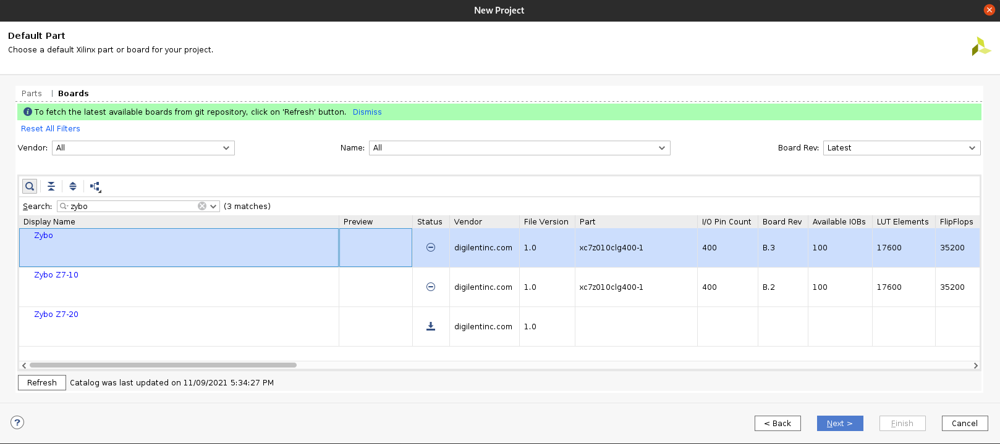

### 2.2 Create Block Design

In the `Flow Navigator` window, under `IP INTEGRATOR` click `Create Block Design`.


In the `Diagram` window, press the `+` button or right-click and press `Add IP`.

Search for `Zynq` in the pop-up window and double-click `ZYNQ7 Processing System`.


Locate the ZIP file that we exported in step [1.5 FINPUSS](#15-export-rtl-as-ipxo), and unzip the file.


Go back to the `Flow Navigator` window in Vivado and click `IP Catalog` under `PROJECT MANAGER`.

Right-click anywhere in the `IP Catalog` tab and click `Add Repository` and select the folder that we unzipped.


Expand the `User Repository` folder and double-click `Fir`.

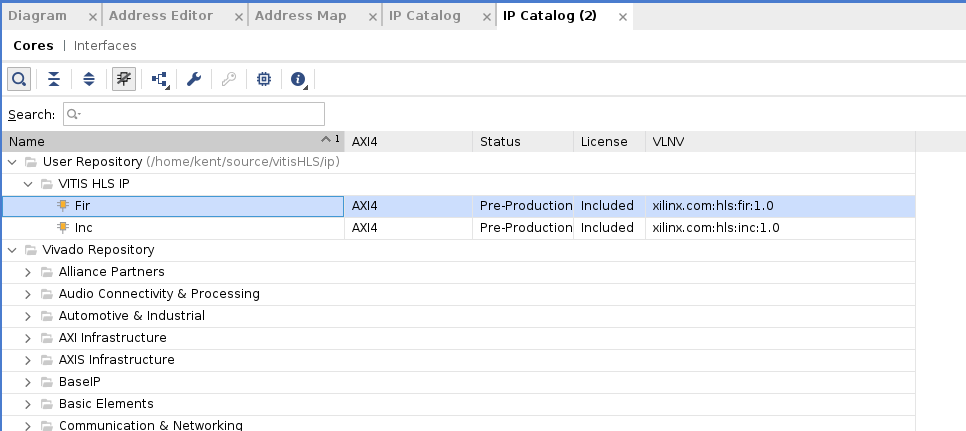

Click the `Add IP to Block Design` button.


Return to the `Diagram` window. It should now look something like this:


Click `Run Block Automation`.
The presets should look like the image below. Click the `OK` button.


Click `Run Connection Automation`.
The presets should look like the image below. Click the `OK` button.


Click the `Regenerate Layout` button located in the `Diagram` window's toolbar.


If everything is done correctly, the diagram should now look like this:


Click the `Validate Design` button located in the `Diagram` window's toolbar.


Ignore the four critical warning messages.
Clik the `OK` button.

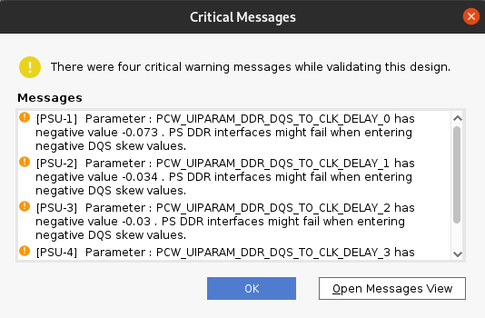

### 2.3 Create HDL Wrapper and generate bitstream

Right-click the design file unser `Sources` and click `Create HDL Wrapper`.

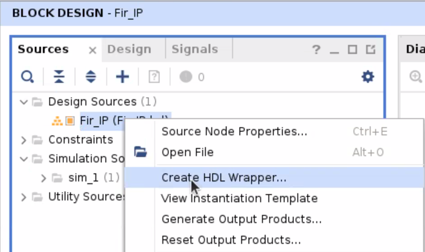

Select the `Let Vivado manage wrapper and auto-update` option and click the `OK` button.


In the `Flow Navigator` window, click the `Generate Bitstream` button located under `PROGRAM AND DEBUG`.


Click the `OK` button.

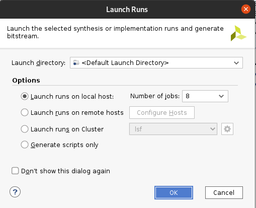

This will take some time. Eventually you will be met with a window like this:


### 2.4 Export Hardware Platform

Click `File` --> `Export` --> `Export Hardware`.


Choose the `Include bitstream` option and click the `Next` button.


Choose a suitable XSA file name and location, and click the `Next` button. In the final window, click the `Finish` button.


## 3. Vitis

### 3.1 Create Platform Project

Start Vitis IDE and choose a suitable location for your workspace.


When met by the welcome screen, choose `Create Platform Project`.


Choose a suitable platform project name and click `Next`.

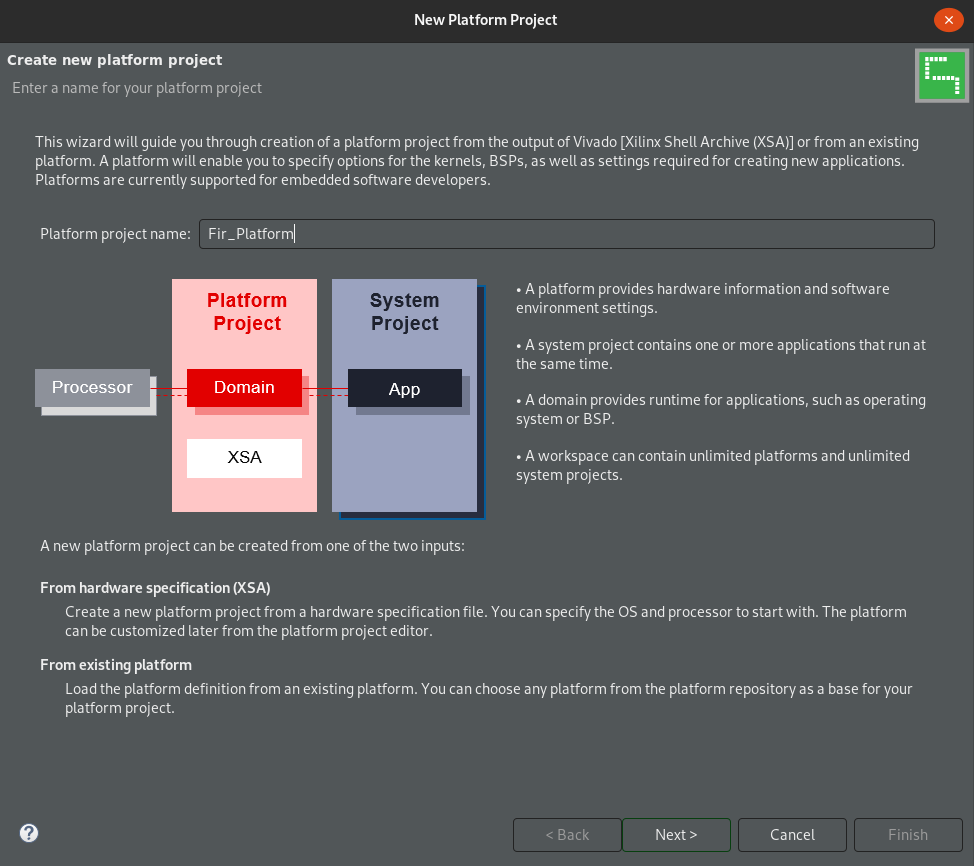

Under `Hardware Spesification` click `Browse` and select the XSA file that we created in step LINK.

Ensure that the `Software Specification` section matches the image below, and click `Finish`.

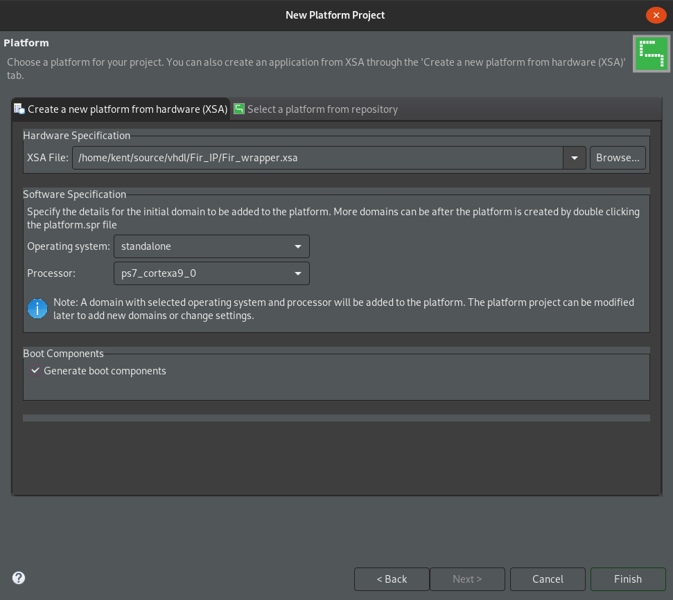

After the project has been generated, you will be met with this window.


In the `Explorer` window on the left, right-click the platform project, and click `Build Project`.

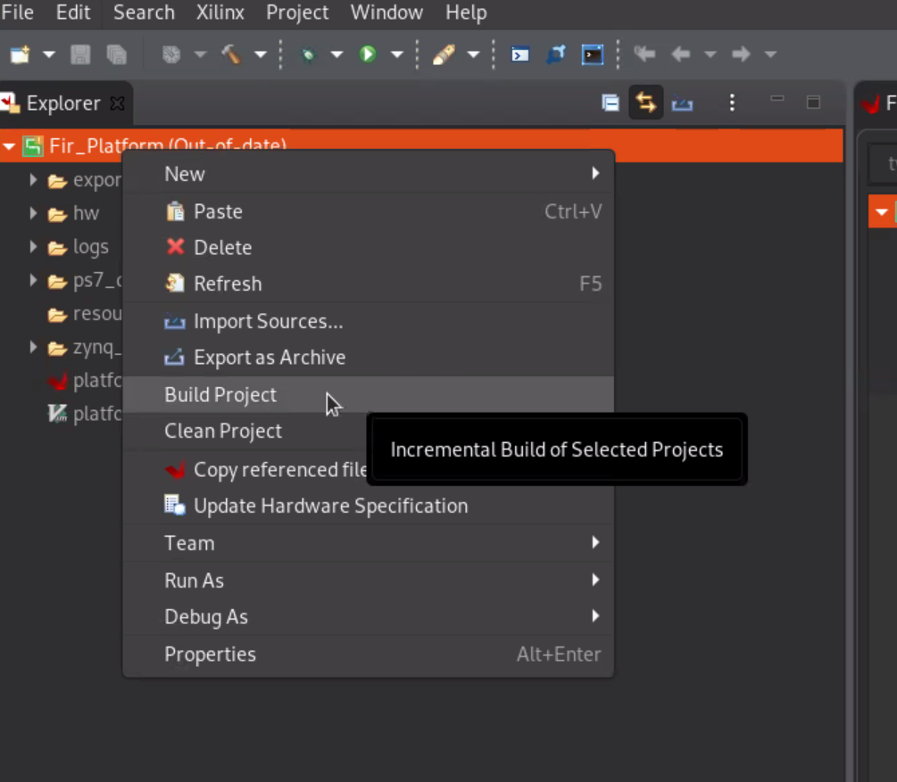

### 3.2 Create Application Project

Create the Application Project. Click `File` --> `New` --> `Application Project`.

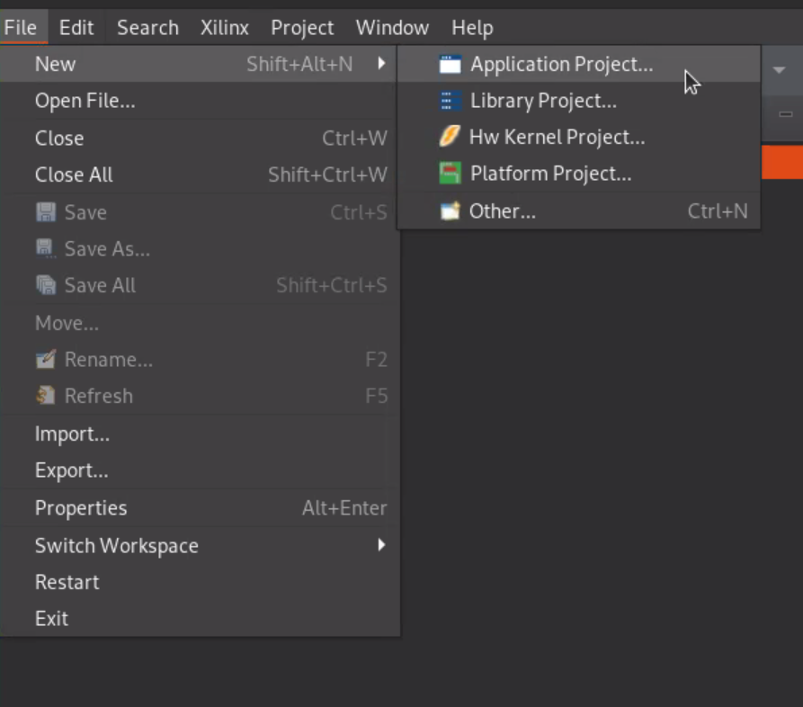

Select the platform that we have created and click `Next`.

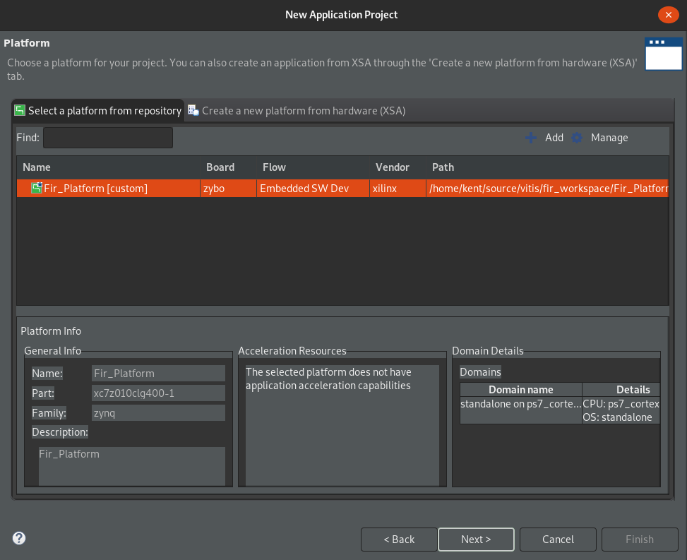

Give the Application Project a suitable name and click `Next`.


Click `Next`.


Select the `Hello World` template and click `Finish`.

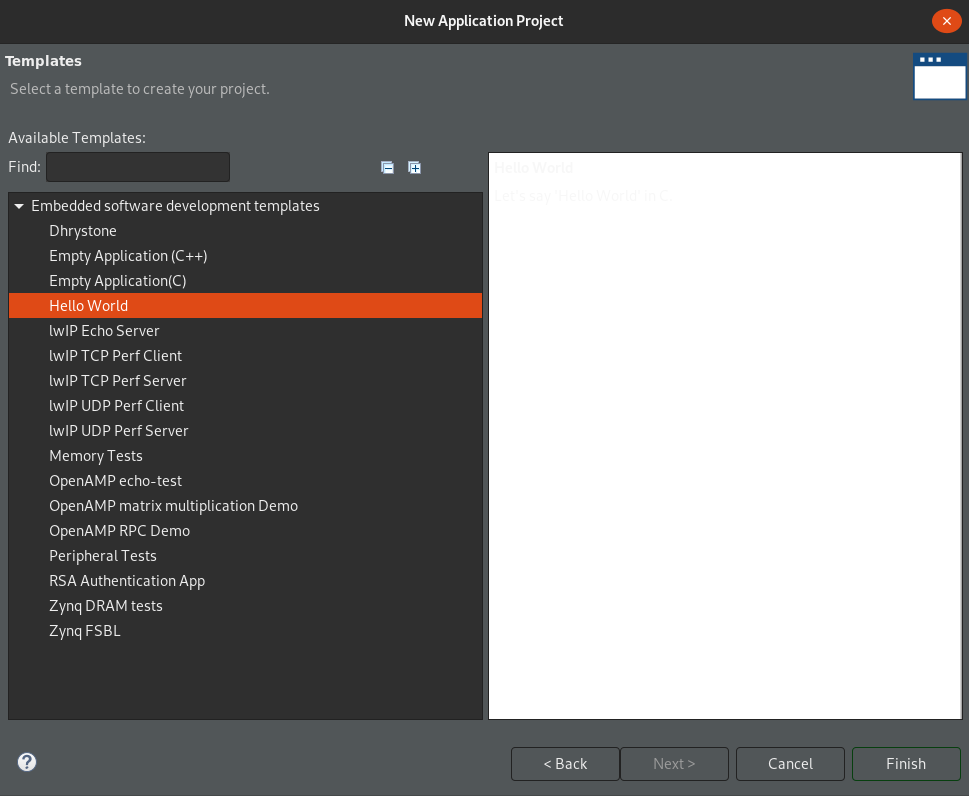

You will now be met by the generated Application Project. It should look something like this:


### 3.3 Copy paste file content from Git.
The source code can be found here:
* [main.c](src/main.c)

Swap the file content of `helloworld.c` with `src/main.c` from the Git repository.

### 3.4 Build and Run Project

In the Explorer window, right-click your application and choose `Build Project`.


